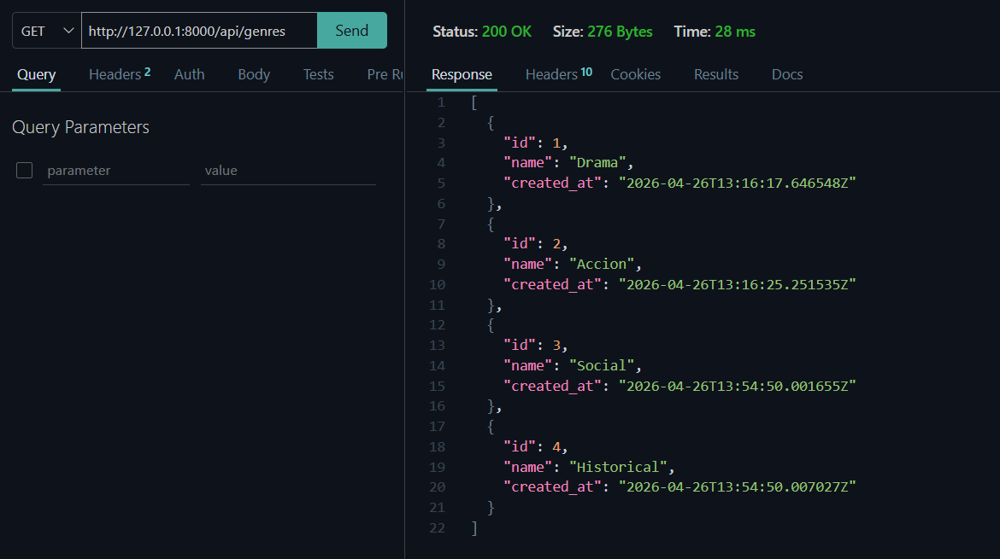
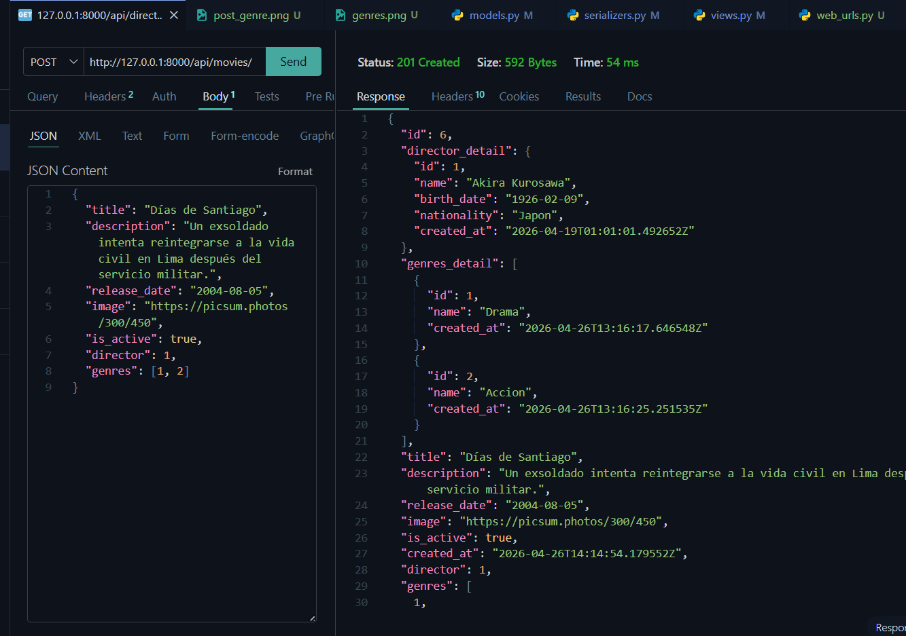
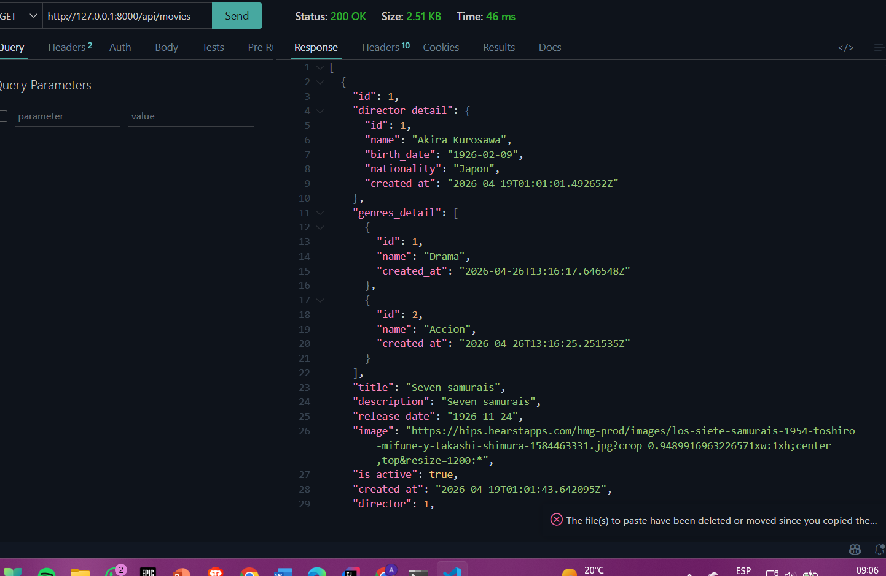
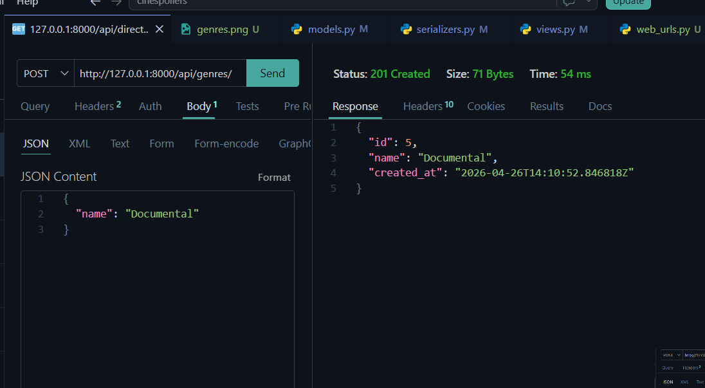

# 🎬 CINESPOILERS API - DIRECTORES

API REST desarrollada con Django Rest Framework para la gestión de **Directores**.

---

## 👥 Integrantes

* Anderson Jair Rivera Pucuhuayla
* Yojhan Leodan Hunaca Yucra 

---

#  PRUEBAS CON THUNDER CLIENT
## Anderson rivera 
### 1. Listar generos (GET)

### 2. Crear movies with genre  (POST)

### 3 . Listar peliculas  (GET)

### 4 . Crear genero   (POST)

# Yojhan Huancca Yucra

## Evidencias
## movies
### 1. Listar Películas (GET)
**Ruta:** `GET /api/movies/`  

### 2. Crear Películas (POST)
**Ruta:** `POST /api/movies/`  

### 3. Actualizar Películas (PUT)
**Ruta:** `PUT /api/movies/{id}/`  

### 4. Actualización parcial (PATCH)
**Ruta:** `PATCH /api/movies/{id}/`  

### 5. Eliminar Películas (DELETE)
**Ruta:** `DELETE /api/movies/{id}/`  

### 6. Data Base

## Genres

### 3. Listar Genres  (GET)
**Ruta:** `GET /api/genres/`

### 2. Crear Genres (POST)
**Ruta:** `POST /api/genres/`

### 3. Listar Genres  (GET)
**Ruta:** `GET /api/genres/1/`

### 4. Actualizar Genres (PUT)
**Ruta:** `PUT /api/genres/2/`

### 5. Actualización parcial (PATCH)
**Ruta:** `PATCH /api/genres/1/`

### 6. Eliminar Genres (DELETE)
**Ruta:** `DELETE /api/genres/3/`

### 7. Listar Genres  (GET)
**Ruta:** `GET /api/genres/3/`

### 8. Data Base

