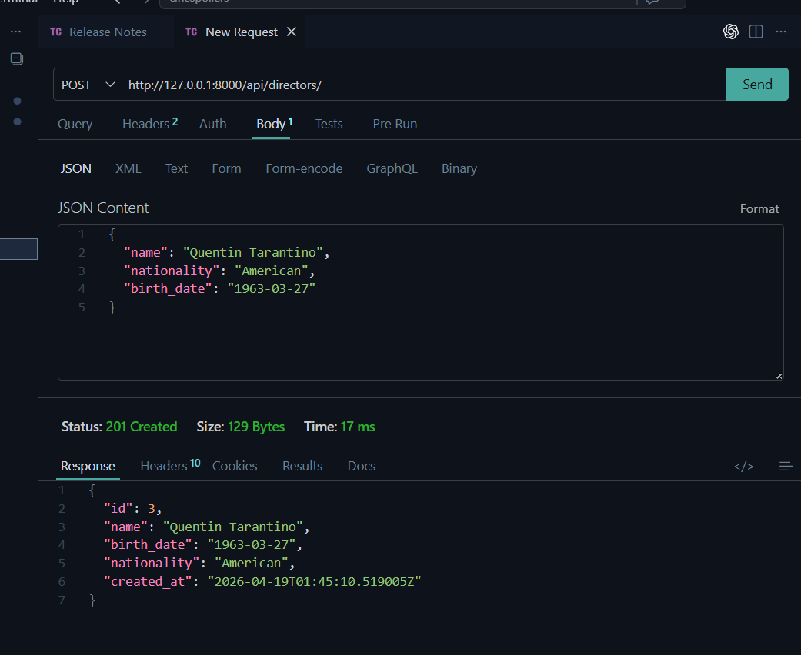
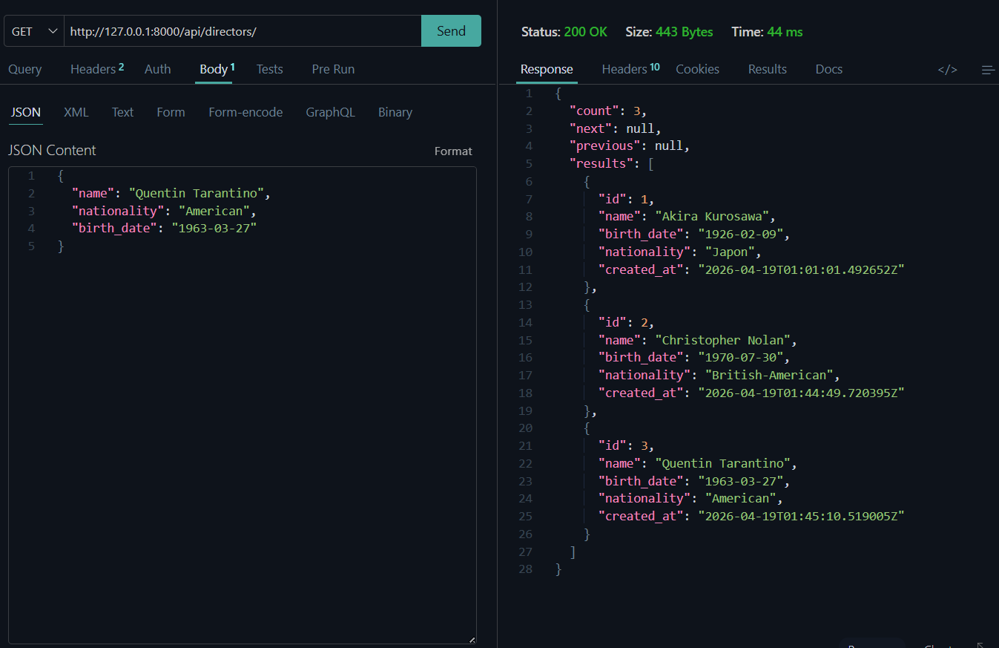
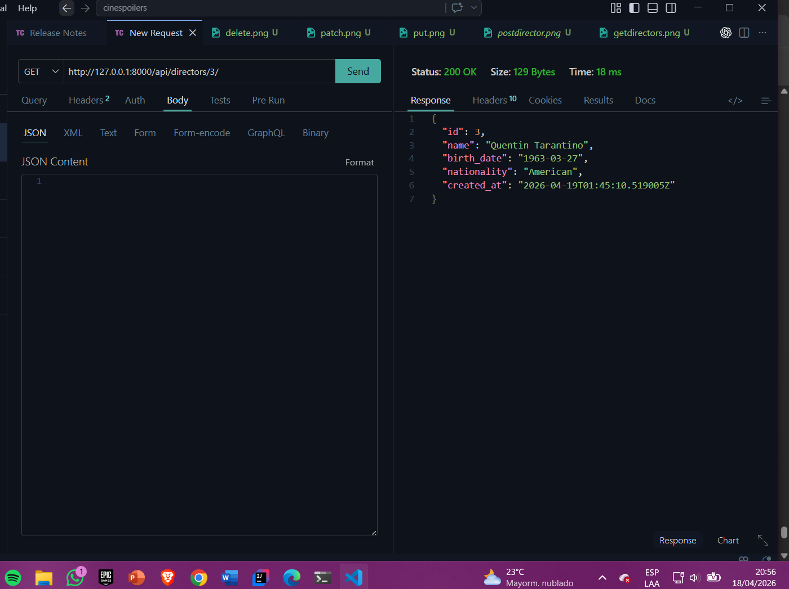
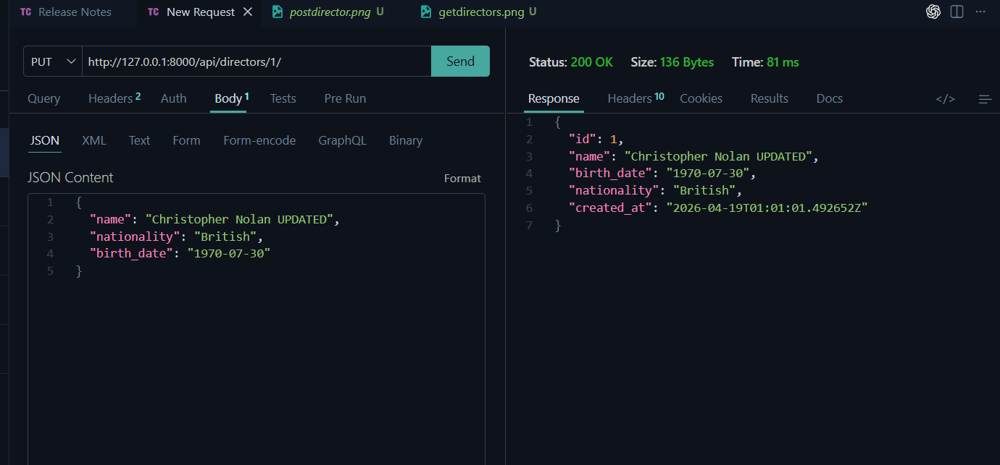
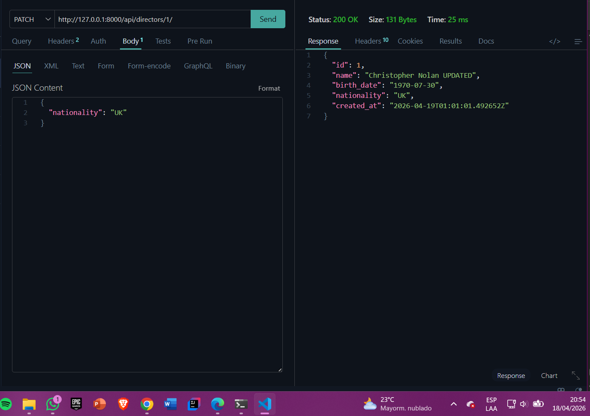
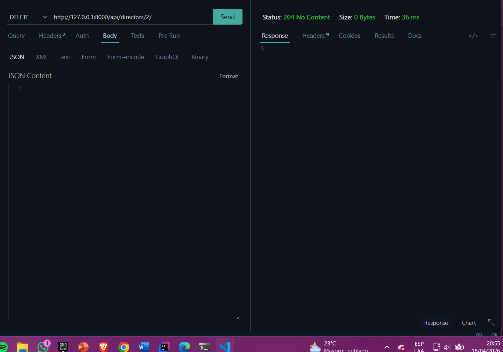

# 🎬 CINESPOILERS API - DIRECTORES

API REST desarrollada con Django Rest Framework para la gestión de **Directores**.

---

## 👥 Integrantes

* Anderson Jair Rivera Pucuhuayla
* Yojhan Leodan Hunaca Yucra 

---

## 🚀 Tecnologías utilizadas


* Python
* Django
* Django Rest Framework
* SQLite
* Thunder Client (VS Code)
* Git & GitHub

---

## 🧠 Descripción

Este módulo permite realizar operaciones CRUD sobre la entidad **Director**, incluyendo validaciones y pruebas mediante Thunder Client.

---

## 🧱 Modelo Director

Campos:

* `name` → Nombre del director
* `nationality` → Nacionalidad
* `birth_date` → Fecha de nacimiento

---

## 🔗 Endpoint Base

```id="ep1"
http://127.0.0.1:8000/api/directors/
```

---

#  PRUEBAS CON THUNDER CLIENT
## Anderson rivera 
---

##  1. Crear Director (POST)

```id="ep2"
POST /api/directors/
```

Body:

```json id="json1"
{
  "name": "Christopher Nolan",
  "nationality": "British-American",
  "birth_date": "1970-07-30"
}
```

📸 Evidencia:


---

## 📋 2. Listar Directores (GET)

```id="ep3"
GET /api/directors/
```

📸 Evidencia:


---

##  3. Obtener Director por ID (GET)

```id="ep4"
GET /api/directors/1/
```

📸 Evidencia:


---

## 4. Actualizar Director (PUT)

```id="ep5"
PUT /api/directors/1/
```

📌 Body:

```json id="json2"
{
  "name": "Christopher Nolan Updated",
  "nationality": "British",
  "birth_date": "1970-07-30"
}
```

📸 Evidencia:


---

##  5. Actualización Parcial (PATCH)

```id="ep6"
PATCH /api/directors/1/
```

📌 Body:

```json id="json3"
{
  "nationality": "UK"
}
```

📸 Evidencia:


---

##  6. Eliminar Director (DELETE)

```id="ep7"
DELETE /api/directors/1/
```

📸 Evidencia:

---

# Yojhan Huancca Yucra

## Evidencias
## movies
### 1. Listar Películas (GET)
**Ruta:** `GET /api/movies/`  


### 2. Crear Películas (POST)
**Ruta:** `POST /api/movies/`  


### 3. Actualizar Películas (PUT)
**Ruta:** `PUT /api/movies/{id}/`  


### 4. Actualización parcial (PATCH)
**Ruta:** `PATCH /api/movies/{id}/`  


### 5. Eliminar Películas (DELETE)
**Ruta:** `DELETE /api/movies/{id}/`  


### 6. Data Base


## Genres
**Ruta:** `GET /api/genres/`


**Ruta:** `POST /api/genres/`


**Ruta:** `GET /api/genres/1/`


**Ruta:** `PUT /api/genres/2/`


**Ruta:** `PATCH /api/genres/1/`


**Ruta:** `DELETE /api/genres/3/`


**Ruta:** `GET /api/genres/3/`


### 6. Data Base


